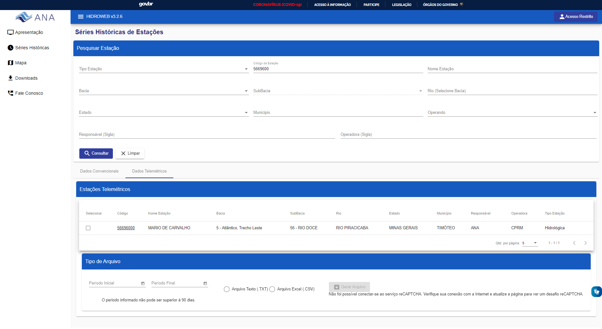
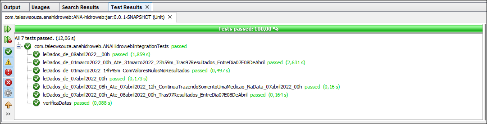

# ANA-hidroweb

Projeto de demonstração para testar a API do HIDROWEB da Agência Nacional de Águas (ANA). https://www.snirh.gov.br/hidroweb. O projeto é baseado nas requisições HTTP GET do site https://www.snirh.gov.br/hidroweb/serieshistoricas. As mesmas informaçoes podem ser verificadas através de outro módulo do sistema que apresenta as informações em outro formato de visualização (no link http://www.snirh.gov.br/hidrotelemetria).

As principais informações de medição, também podem ser baixadas através do site [HIDROWEB](https://www.snirh.gov.br/hidroweb/serieshistoricas) ou [HIDROTELEMETRIA]http://www.snirh.gov.br/hidrotelemetria).

## Site HIDROWEB




### Dados baixados do site para conferência de alguns dos testes em 09/04/2022

[Dados de março 2022](dadosParaVerificacao/56696000-MARIO%20DE%20CARVALHO.csv)


## Passos na recuperação da informação

A sequência de passos para trazer as informações através de uma requisição REST são:

1. Realizar uma requisição em `https://www.snirh.gov.br/hidroweb/rest/api/estacaotelemetrica?id={id}` passando como parâmetro o número da estação de qual irá requisitar os dados, tal como o seguinte exemplo: 
    - `https://www.snirh.gov.br/hidroweb/rest/api/estacaotelemetrica?id=5669600`
2. Recuperar o novo `id` da estação a partir do json retornado na requisição, para será usado na próxima requisição
    - 
3. Realizar uma nova requisição em `https://www.snirh.gov.br/hidroweb/rest/api/documento/gerarTelemetricas?codigosEstacoes={codigosEstacoes}&tipoArquivo={tipoArquivo}&periodoInicial={periodoInicial}&periodoFinal={periodoFinal}`, abaixo um exemplo de uma requisição, usando os dados da requisição anterior (novo id da estação).
    - `https://www.snirh.gov.br/hidroweb/rest/api/documento/gerarTelemetricas?codigosEstacoes=193142390&tipoArquivo=2&periodoInicial=2022-02-11T03:00:00.000Z&periodoFinal=2022-02-12T03:00:00.000Z`


## Testes Unitários

```java
@BeforeEach
public void setUp() {
    formatter.setTimeZone(TimeZone.getTimeZone("UTC"));

    params = new HashMap<>();
    params.put("id", "5669600");

    //https://www.snirh.gov.br/hidroweb/rest/api/estacaotelemetrica
    estacao = restTemplate.getForObject(apiAnaEstacaotelemetrica, EstacaoTelemetrica.class, params);

    params = new HashMap<>();
    params.put("codigosEstacoes", estacao.getId());
    params.put("tipoArquivo", 2);
}

@Test
void leDados_de_07abril2022_00h() {
    params.put("periodoInicial", formatter.format(convertToDate(LocalDate.of(2022, Month.APRIL, 7))));
    params.put("periodoFinal", formatter.format(convertToDate(LocalDate.of(2022, Month.APRIL, 7))));

    //https://www.snirh.gov.br/hidroweb/rest/api/documento/gerarTelemetricas
    telemetria = restTemplate.getForObject(apiAnaGerarTelemetricas, TelemetricaContent[].class, params);

    assertEquals(1, telemetria[0].getMedicoes().size());

    ArrayList<Medicao> medicoes = telemetria[0].getMedicoes();

    Medicao dados_07abril2022_00h = medicoes.get(medicoes.size() - 1); // lê a última posição

    assertEquals(convertToDate(LocalDate.of(2022, Month.APRIL, 7)), dados_07abril2022_00h.getId().getHorDataHora());
    assertEquals(0.0d, dados_07abril2022_00h.getHorChuva());
    assertEquals(159, dados_07abril2022_00h.getHorNivelAdotado());
    assertEquals(44.57d, dados_07abril2022_00h.getHorVazao());
}
```


### Resultados dos Testes Unitários em 09/04/2022




### Json parcial resultado da resquisição em 09/04/2022


AbaDeixei uma amostra do arquivo json retornado. O arquivo contém mais informações sobre a estação de medição, tais como cidade, rio, bacia, posição (latitude e longitude), etc.

```json
[
    {
        "id": 193142390,
        "codigoEstacao": "56696000",
        "codigoAdicional": "56696000",
        "aneelPlu": "1942029",
        "aneelFlu": "56696000",
        "nome": "MARIO DE CARVALHO",
        "latitude": -19.5247,
        "longitude": -42.6408,
        "altitude": 232,
        "ultimaAtualizacao": "2019-10-03T03:00:00.000+0000",
        "baciaCodigo": 5,
        "codigoNomeBacia": "5 - Atlântico, Trecho Leste",
        "codigoNomeSubBacia": "56 - RIO DOCE",
        "nomeRio": "RIO PIRACICABA",
        "nomeEstado": "MINAS GERAIS",
        "nomeMunicipio": "TIMÓTEO",
        "subBaciaCodigo": 56,
        "rioCodigo": 56180000,
        "estadoCodigo": 17,
        "municipioCodigo": 17686000,
        "responsavelCodigo": 1,
        "operadoraCodigo": 1,
        "menorDataPeriodo": "2010-01-26T21:00:00.000+0000",
        "maiorDataPeriodo": "2022-04-07T05:30:00.000+0000",
        "responsavelSigla": "ANA",
        "operadoraSigla": "CPRM",
        "tipoEstacao": "Hidrológica",
        "operando": 1,
        "codigoNome": "193142390 - MARIO DE CARVALHO",
        "medicoes": [
            {
                "id": {
                    "horEstacao": 193142390,
                    "horDataHora": "2022-03-01T03:00:00.000+0000"
                },
                "horQChuva": 0.0,
                "horChuva": 0.0,
                "horQNivelAdotado": 0.0,
                "horNivelAdotado": 232.0,
                "horQVazao": 0.0,
                "horVazao": 99.35
            },
            ...
            {
                "id": {
                    "horEstacao": 193142390,
                    "horDataHora": "2022-04-01T02:45:00.000+0000"
                },
                "horQChuva": 0.0,
                "horChuva": 0.0,
                "horQNivelAdotado": 0.0,
                "horNivelAdotado": 160.0,
                "horQVazao": 0.0,
                "horVazao": 45.21
            },
            {
                "id": {
                    "horEstacao": 193142390,
                    "horDataHora": "2022-04-01T03:00:00.000+0000"
                },
                "horQChuva": 0.0,
                "horChuva": 0.0,
                "horQNivelAdotado": 0.0,
                "horNivelAdotado": 159.0,
                "horQVazao": 0.0,
                "horVazao": 44.57
            }
        ],
        "selecionada": null,
        "baixarChuva": false,
        "baixarNivel": false,
        "baixarVazao": false,
        "latFormatada": "S 19° 31' 28.92''",
        "lonFormatada": "W 42° 38' 26.88''",
        "peridoDisponibilidade": "26/01/2010 à 09/04/2022"
    }
]
```